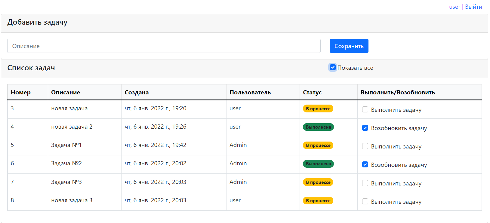
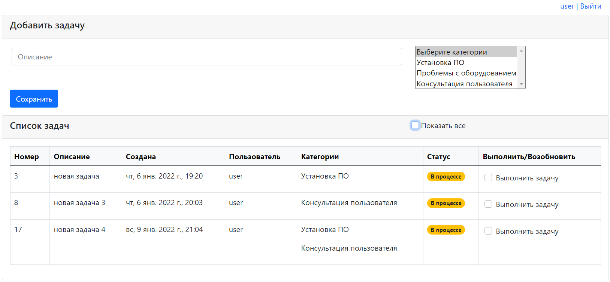

# job4j_todo
## О проекте

Это прриложение реализует список задач.

Пользователь может создать задачу, указав ее имя и категорию.

Статус задачи может быть изменен с помощью чекбокса.

## Обзор

Главная страница.

Главная страница, выбраны только не выполненные задачи.

## Настройка и сборка

У приложения есть один файл конфигурации: /src/main/resources/hibernate.cfg.xml,

в котором необходимо указать настройки Hibernate.

Сборка осуществляется командой: mvn package.

После сборки приложение нужно развернуть в контейнере сервлетов и настроить сервер баз данных.

## Контакты

Email: kostasc@mail.ru
Telegram: @rkostashchuk
