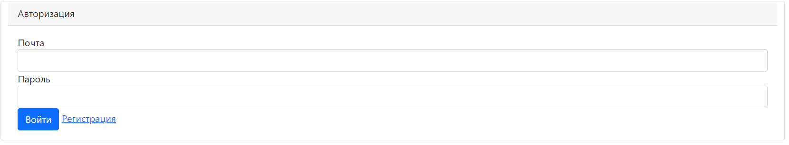
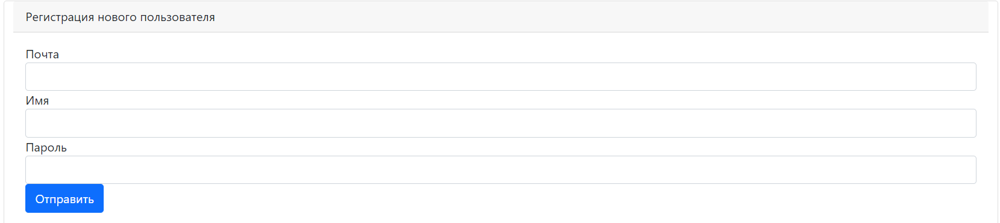
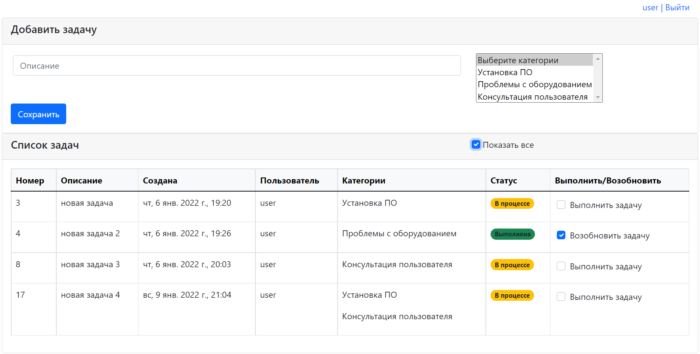

# job4j_todo

It is task tracking application.

User can create task by giving task description and category.

Task status can be changed later by checkbox.

There is a filter for displaying only running tasks.

Login page.

Registration page.

Screen with all tasks.

Screen with running tasks.

